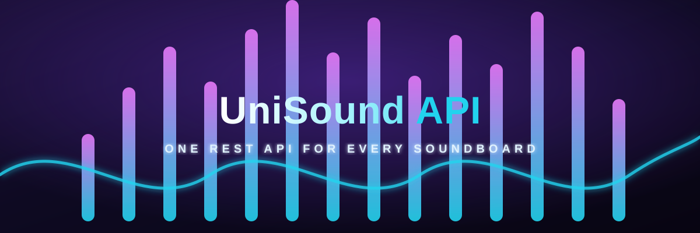

<p align="center"></p>

<p align="center"><strong>One REST API for every soundboard.</strong><br>
Search and browse <b>myinstants</b> · <b>memesoundboard</b> · <b>101soundboards</b> as one clean JSON feed.</p>

<p align="center">
  
  
  
  
  
  
  
  
</p>

UniSound aggregates sound effects from the three biggest soundboard platforms and serves them through a single, consistent, CORS-enabled REST API. One request shape, one JSON schema, three sources — no scrapers to maintain, no soundboard to pick.

## ✨ Features

- 🎧 **3 sound sources, 1 API** — myinstants, MemeSoundboard, and 101Soundboards behind identical response schemas.
- 🔀 **Merged search** — `/search_all?q=bruh` searches every source in parallel and interleaves the best matches (round-robin), with per-source health in the response.
- 📦 **Proper pagination everywhere** — every list endpoint accepts `?page=N`, and `/memesoundboard` adds `?page_size=` plus query-free browse feeds (`sort=new|trending|all`).
- 🔐 **Hotlink-proof audio proxy** — `/stream?url=<encoded mp3>` replays hotlink-protected 101Soundboards files with the correct `Referer`, CORS, and full HTTP `Range` support, so `<audio>` playback and audio-splitters work from any origin. `mp3` is always *playable*; the direct URL (if any) is exposed separately as `mp3_original`.
- ⏱️ **Duration filtering** — `?with_duration=1&min_duration=2&max_duration=6` probes MP3 headers and keeps only the clips you want.
- 🧭 **Two-level category browsing for 101Soundboards** — categories → boards → sounds (`/101categories`, `/101category`, `/101board`).
- ⚡ **Fast** — Vercel edge caching (`s-maxage`), parallel upstream fetches, Cloudflare-safe fallbacks (proxy → Wayback snapshot).
- 🚀 **Serverless** — deploys free on Vercel with separate functions per endpoint; runs locally with a single `php -S` command.
- 🌐 **CORS enabled** — safe to call straight from React/Vue/Node/Discord bots, no proxy needed.

## Table of Contents

- [How It Works](#how-it-works)
- [Quick Start](#quick-start)
- [Endpoints](#-reference)
- [Request Parameters](#request-parameters)
- [The Audio Proxy (`/stream`)](#-the-audio-proxy-stream)
- [Response Example](#response-example)
- [Error Handling](#-error-handling)
- [Examples](#-examples)
- [Run Locally](#-run-locally)
- [Deploy to Vercel](#-deploy-to-vercel)
- [Escaping Cloudflare Anti-Bot (myinstants)](#-escaping-cloudflare-anti-bot-myinstants)
- [Contributing](#-contributing)
- [Credits](#-credits)
- [License & Disclaimer](#%EF%B8%8F-license)

## How It Works

| Source | What you get | Notes |
|:--|:--|:--|
| **myinstants** | `/trending`, `/search`, `/recent`, `/best`, `/uploaded`, `/favorites`, `/category` | Site uses Cloudflare anti-bot; the API falls back to a proxy → Wayback snapshot automatically. No `duration` in the HTML (optional MP3 probing). |
| **memesoundboard** | `/memesoundboard` | Clean DRF JSON API: search by `q`, or browse without a query via `sort=new / trending / all`; full pagination + `page_size`. |
| **101soundboards** | `/101soundboards`, `/101categories`, `/101category`, `/101board` | Sounds carry free `duration` + `thumbnail`. CDN is hotlink-protected, so its `mp3` is served through the built-in proxy. |

Every item carries a `source` field, so you can always tell which provider it came from.

## Quick Start

```bash
# One line, no key, no auth
curl "https://<your-deployment>.vercel.app/search?q=laugh"
```

```javascript
// Node.js
const res = await fetch("https://<your-deployment>.vercel.app/search?q=bruh&min_duration=1&max_duration=6");
const json = await res.json();
console.log(json.data.map(s => s.title));
```

```bash
# Merged search across all three providers
curl "https://<your-deployment>.vercel.app/search_all?q=bruh"
```

## ❇️ Reference

### Endpoints

_Machine-readable: the entire API is described in the bundled [openapi.json](openapi.json) (OpenAPI 3.0) spec — auto-generate clients, SDKs, or docs with any OpenAPI tool._

| Request          | Response                 | Parameter  |
| :--------------- | :----------------------- | :--------: |
| `GET /trending`  | Trending by region       | `q`, `page` |
| `GET /search`    | Search a sound           | `q`, `page` |
| `GET /detail`    | The sound details        |    `id`    |
| `GET /recent`    | Recently uploaded sounds |   `page`   |
| `GET /best`      | Best of all time sounds  | `q`, `page` |
| `GET /uploaded`  | User's uploaded sounds   | `username`, `page` |
| `GET /favorites` | User's favorite sounds   | `username`, `page` |
| `GET /category`  | Sounds by category       | `category`, `q`, `page` |
| `GET /memesoundboard` | Sounds from MemeSoundboard.io (search or browse) | `q`, `sort`, `page`, `page_size` |
| `GET /101soundboards` | Sounds from 101Soundboards.com | `q`, `page` |
| `GET /101categories` | 101Soundboards category (tag) list | _none_ |
| `GET /101category` | Boards inside a 101Soundboards category | `tag`, `page` |
| `GET /101board` | Sounds inside a 101Soundboards board | `board`, `page` |
| `GET /search_all` | Merged search across all sources | `q`, `page` |
| `GET /stream` | Hotlink-safe audio proxy | `url` |

_All list endpoints support pagination via `?page=N` (default `1`) and duration probing via `?with_duration=1&min_duration=2&max_duration=6`._

_Each item carries a `source` field (`myinstants`, `memesoundboard`, `101soundboards`). `/search_all` interleaves all sources (round-robin) and reports per-source status in `sources`. 101Soundboards items include `thumbnail` and a free `duration` (no probing needed)._

_101Soundboards is two levels deep: a category (tag) page lists **boards**, and each board holds the actual sounds. Use `/101categories` to list the available tags, `/101category?tag=games` to page through boards, then `/101board?board=36000-halo-ringtones` to get the sounds of one board._

_`/memesoundboard` has two modes: pass `?q=` to search by name, or omit `q` to browse the catalog without a query — `sort` selects the feed (`new` = newest, default, `trending`, `all` = full catalog). `page_size` (1–100, default 35) tunes the page size. Example: `/memesoundboard?sort=trending&page=2&page_size=50`._

### Request Parameters

|    Parameter    | Description                                              |
| :-------------: | :------------------------------------------------------- |
|      `q`        | Search query or region                                   |
|   `username`    | User's username                                          |
|      `id`       | Sound's unique ID                                        |
|     `page`      | Page number (>= 1, default `1`). Example: `?page=4`      |
|    `sort`       | memesoundboard browse feed: `new` (default), `trending`, `all`. Only used when `q` is omitted |
|  `page_size`    | memesoundboard page size (1–100, default 35)             |
|   `category`    | myinstants category (required for `/category`, case-insensitive). One of: `anime & manga`, `games`, `memes`, `movies`, `music`, `politics`, `pranks`, `reactions`, `sound effects`, `sports`, `television`, `tiktok trends`, `viral`, `whatsapp audios` |
|     `tag`       | 101Soundboards category tag (required for `/101category`, slug or name). One of: `anime-comics-cartoons`, `celebrities`, `comedy`, `games`, `memes-funny`, `movies`, `music-musicians`, `nature`, `other`, `politics`, `sound-fx`, `sports`, `streamers-twitch-podcasts`, `tv`, `united-kingdom`, `united-states` |
|    `board`      | 101Soundboards board slug, `boards/{id-slug}`, or full URL (required for `/101board`). Example: `?board=36000-halo-ringtones` |
|     `url`       | URL-encoded mp3 to replay through the proxy (required for `/stream`) |
| `with_duration` | `1` to include MP3 `duration` (seconds) per sound        |
| `min_duration`  | Only keep sounds >= N seconds (implies `with_duration`)  |
| `max_duration`  | Only keep sounds <= N seconds (implies `with_duration`)  |

_Note: `myinstants.com` exposes no durations in its HTML, so `with_duration` / `min_duration` / `max_duration` probe each MP3 and parse the MPEG frame headers. Lists stay fast by default; responses are slower (parallel fetch, best-effort, `duration: null` when undetectable) only when duration params are used._

### 🔒 The Audio Proxy (`/stream`)

101Soundboards protects its CDN (`hoovers.101soundboards.com`) with a same-site `Referer` check — a bare `<audio src="…">` or direct link 403s from any other origin. UniSound solves this with a built-in streaming proxy:

```
GET /stream?url=https%3A%2F%2Fhoovers.101soundboards.com%2Fsounds%2F...mp3
```

- Proxies only the whitelisted audio hosts (`*.101soundboards.com`, `*.soundboard.cloud`), so it can't be used as an open relay.
- Replays the file with the correct `Referer`, sets open CORS headers, and **passes through HTTP `Range` requests** (`Accept-Ranges`, `Content-Length`, `206 Partial Content`), so it behaves exactly like the original file: seeking, preloading and audio-splitters all work.
- For every sound item, `mp3` is **always the playable URL** — a `/stream` link for hotlink-protected sources, a direct `.mp3` otherwise. When a direct URL exists too, it's returned as `mp3_original`.

### Response Example

A typical successful response (HTTP 200) will return a JSON object like this:

```json
{
  "status": "200",
  "author": "wissam333",
  "source": "memesoundboard",
  "mode": "search",
  "page_size": 35,
  "page": 1,
  "count": 35,
  "total_pages": 13,
  "has_next": true,
  "data": [
    {
      "id": "12108",
      "title": "Enisa folk",
      "url": "https://memesoundboard.io/search/new",
      "mp3": "https://play-v1.soundboard.cloud/media/sounds/20261009_041819_Enisa_folk.mp3",
      "duration": null,
      "source": "memesoundboard"
    }
  ]
}
```

_`page` / `count` / `total_pages` / `has_next` are returned by all list endpoints (`total_pages` is parsed from the upstream `Page X of Y` title, `null` when undetectable). `duration` (seconds) only appears when `with_duration=1` or `min_duration` / `max_duration` is used. `/category` additionally echoes `category` and `region` (`null` when global). `/101category` echoes `tag`, `name`, and `kind: "boards"` (its items are boards, not sounds); `/101board` echoes `board`. 101Soundboards items also carry `thumbnail` and `mp3_original`._

_`source` is `"live"` normally, `"proxy"` when served via your scraper proxy, or `"archive"` when `myinstants.com` blocked the request and the data was served from the latest Wayback Machine snapshot instead (data may be older; `mp3` links still point at the live site, and archive responses are edge-cached for 24h). If no source works, the API returns HTTP `502` — retry later._

## 💥 Error Handling

All errors return JSON objects with an appropriate HTTP status code (e.g., 404, 400) and a `message` explaining the issue.

- **400 Error** — bad request (e.g., invalid page, unknown `sort`, missing required param):

  ```json
  {
    "status": "400",
    "author": "wissam333",
    "message": "Invalid 'sort' (new|trending|all), example: ?sort=trending"
  }
  ```

- **404 Error** — when the page is not found or an invalid endpoint is accessed:

  ```json
  {
    "status": 404,
    "author": "wissam333",
    "message": "Endpoint not found"
  }
  ```

- **502 Error** — when an upstream provider refuses the request (HTTP 403/429 anti-bot protection). Retry later — cached responses still work:

  ```json
  {
    "status": 502,
    "author": "wissam333",
    "message": "Upstream myinstants.com refused this request (HTTP 403, anti-bot protection). Please retry later."
  }
  ```

## 🌐 Examples

### Example 1: Trends & Search

```http
GET https://<your-deployment>.vercel.app/trending?q=id
GET https://<your-deployment>.vercel.app/search?q=laugh
```

### Example 2: Sound Details

```http
GET https://<your-deployment>.vercel.app/detail?id=akh-26815
```

### Example 3: Recently Uploaded / Best of All Time

```http
GET https://<your-deployment>.vercel.app/recent
GET https://<your-deployment>.vercel.app/best?q=id
```

### Example 4: A User's Uploads & Favorites

```http
GET https://<your-deployment>.vercel.app/uploaded?username=hellmouz
GET https://<your-deployment>.vercel.app/favorites?username=hellmouz
```

### Example 5: Paginate Any List (e.g. Trending Syria, Page 4)

```http
GET https://<your-deployment>.vercel.app/trending?q=sy&page=4
GET https://<your-deployment>.vercel.app/search?q=laugh&page=2
GET https://<your-deployment>.vercel.app/recent?page=2
```

### Example 6: Only 2–6 Second Sounds

```http
GET https://<your-deployment>.vercel.app/search?q=laugh&min_duration=2&max_duration=6
GET https://<your-deployment>.vercel.app/trending?q=sy&page=4&min_duration=2&max_duration=6
```

### Example 7: Sounds by Category (Optional Region + Pagination)

```http
GET https://<your-deployment>.vercel.app/category?category=music
GET https://<your-deployment>.vercel.app/category?category=anime%20%26%20manga&q=sy&page=9
```

### Example 8: Other Providers (Merged or Per-Source)

```http
GET https://<your-deployment>.vercel.app/search_all?q=bruh&page=1
GET https://<your-deployment>.vercel.app/memesoundboard?q=bruh&page=2
GET https://<your-deployment>.vercel.app/101soundboards?q=bruh&page=2&min_duration=2&max_duration=6
```

### Example 9: Browse MemeSoundboard Without a Query

```http
GET https://<your-deployment>.vercel.app/memesoundboard
GET https://<your-deployment>.vercel.app/memesoundboard?sort=trending&page=2
GET https://<your-deployment>.vercel.app/memesoundboard?sort=all&page_size=50
```

### Example 10: Browse 101Soundboards (tags -> boards -> sounds)

```http
GET https://<your-deployment>.vercel.app/101categories
GET https://<your-deployment>.vercel.app/101category?tag=games&page=1
GET https://<your-deployment>.vercel.app/101board?board=36000-halo-ringtones
```

### Example 11: Audio Proxy (seekable, range-friendly)

```http
GET https://<your-deployment>.vercel.app/stream?url=https%3A%2F%2Fhoovers.101soundboards.com%2Fsounds%2Fhalo-ringtones%2Fmaster-chief.mp3
```

## 🚀 Run Locally

```bash
git clone https://github.com/wissam333/unisound-api.git
cd unisound-api
# simple_html_dom.php lives in lib/ (already vendored in this repo)
php -S localhost:8000 router.php
```

Then open `http://localhost:8000/search?q=laugh`. The included `router.php` mirrors Vercel's routing exactly, so you get the same extensionless URLs locally.

## ☁️ Deploy to Vercel

[](https://vercel.com/new/clone?repository-url=https%3A%2F%2Fgithub.com%2Fwissam333%2Funisound-api)

**Requirements**: PHP 7.4+ runtime (enabled on Vercel), `curl` extension, no external database. The API detects its own base URL, so zero configuration is needed to go live.

## 🛡️ Escaping Cloudflare Anti-Bot (myinstants)

`myinstants.com` runs Cloudflare bot protection that sometimes blocks datacenter IPs (Vercel) with HTTP 403. Browser headers alone can't pass it, and free forward-proxies (corsproxy.io, allorigins, codetabs…) don't either. The reliable, serverless-friendly fix is a free-tier **scraper API** (a cloud browser that solves the challenge for you):

1. Sign up for free credits — [ZenRows](https://www.zenrows.com/) (~2,000 free credits, no card) or [ScrapingBee](https://www.scrapingbee.com/) (~1,000 free credits).
2. Copy your API key and set it in Vercel → Settings → Environment Variables.
3. Set `UPSTREAM_PROXY_TEMPLATES` (comma-separated, tried in order):

```
# ZenRows (recommended) — antibot+js_render flags are what defeat Cloudflare:
UPSTREAM_PROXY_TEMPLATES=https://api.zenrows.com/v1/?apikey=KEY&url={url}&js_render=true&antibot=true&premium_proxy=true

# ScrapingBee — stealth_proxy is their Cloudflare-bypass mode:
UPSTREAM_PROXY_TEMPLATES=https://app.scrapingbee.com/api/v1/?api_key=KEY&url={url}&render_js=true&stealth_proxy=1

# You can chain several (comma-separated) to mix free tiers:
UPSTREAM_PROXY_TEMPLATES=https://api.zenrows.com/v1/?apikey=KEY1&url={url}&js_render=true&antibot=true,https://app.scrapingbee.com/api/v1/?api_key=KEY2&url={url}&render_js=true&stealth_proxy=1
```

> **Credits last longer than they look:** the proxy is only consulted *after* a direct fetch fails with 403/429 (live is always tried first), and every proxied page is edge-cached (`CACHE_SMAXAGE_PROXY=2592000` ≈ 30 days), so one credit can serve many requests. Without any proxy configured, the API auto-falls back to Wayback Machine snapshots (`source: "archive"`), and the **memesoundboard and 101Soundboards sources are unaffected by myinstants' Cloudflare entirely.** For myinstants, if no source works, the API returns HTTP `502` — retry later.

## 🌱 Contributing

Contributions are welcome — see [CONTRIBUTING.md](CONTRIBUTING.md) for setup and style notes. To contribute:

1. Fork the repository.
2. Create a feature branch: `git checkout -b feature-name`.
3. Commit your changes: `git commit -m 'Add feature'`.
4. Push to the branch: `git push origin feature-name`.
5. Submit a pull request.

## 🙏 Credits

- Original myinstants API by [abdipr](https://github.com/abdipr/myinstants-api).
- Extended into a multi-source API (memesoundboard + 101Soundboards, audio proxy, duration filters, category browsing) and maintained by [wissam333](https://github.com/wissam333).

## ⚖️ License

This project is licensed under the `MIT License`. See the [LICENSE](https://github.com/wissam333/unisound-api/blob/main/LICENSE) file for more information.

## ⚠️ Disclaimer

The sounds contained in this API are obtained from the original [MyInstants](https://www.myinstants.com), [MemeSoundboard](https://memesoundboard.io), and [101Soundboards](https://www.101soundboards.com) websites by web scraping. Developers using this API must follow the applicable regulations by mentioning this project or the official owners in their projects and are prohibited from abusing this API for personal benefits.

[⬆️ Back to Top](#readme)